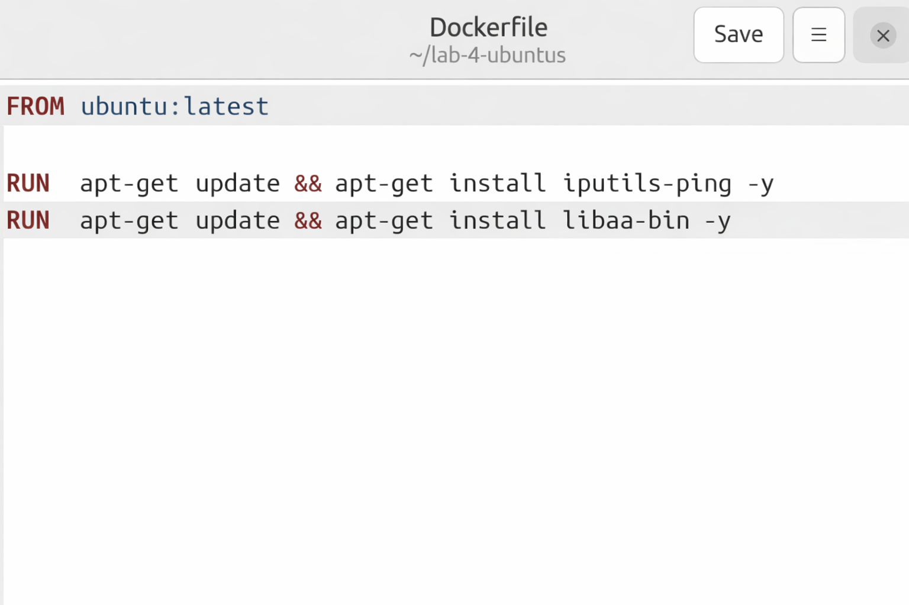
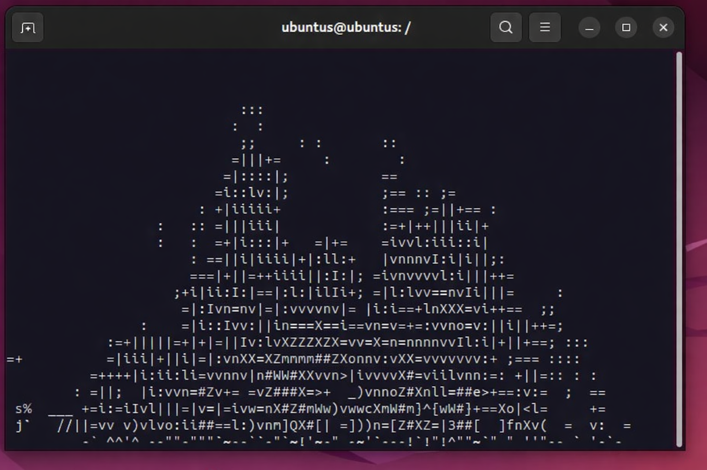
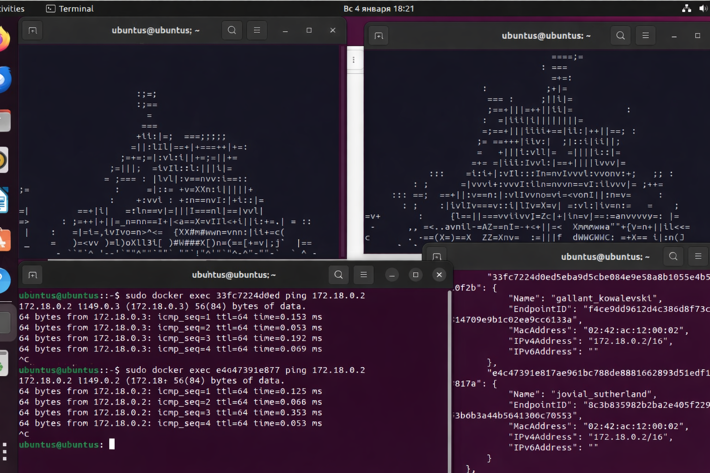

**Краткий отчет по лабораторной работе № 4**

**Цель:**

- Запуск приложения aafire

- Настройка сети

- Тестирование соединения

Был создан Dockerfile с установленными в него ping и libaa-bin (aafire)

Затем собран образ этого контейнера через команду: \"docker build -t
aafire .\". После контейнер был запущен и осуществлено подключение я к
нему командой: \"docker run -it aafire\", внутри контейнера включен
aafire.

Далее был запущен второй контейнер с aafire, а затем создана сеть, через
команду \"docker network create myNetwork\", и оба контейнера добавлены
в эту сеть: \"docker network connect myNetwork \[container name\]\".

Затем через команду \"docker network inspect myNetwork\" были найдены
ip-адреса добавленных контейнеров. Через терминал, запущенный отдельно
от контейнеров, были запущены две комманды поочерёдно: \"docker exec
\[container name\] ping \[another container ip\]\"

